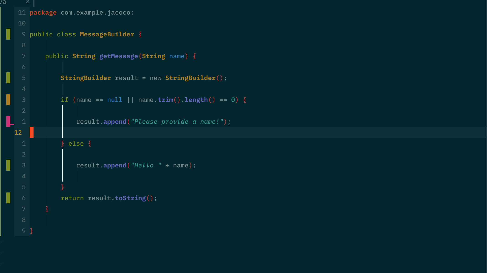

# BLANKET.NVIM 🛌🏻
> Designed to induce that warm and fuzzy feeling of knowing that your code is covered

# Overview
This plugin provides a code coverage gutter in Neovim based on the Jacoco reports for Java projects.

### Features
* Displaying `uncoverted`, `covered` and `partially covered` (not all code branches are executed) lines
* Watch report for changes and refresh the coverage gutter
* Autocomands to fire when specific file type is opened



# Configurations
Only `report_path` is required, everything else is optional.
```lua

lua << EOF
    require'blanket'.setup{
        -- can use env variables and anything that could be interpreted by expand(), see :h expandcmd()
        -- OPTIONAL
        report_path = vim.fn.getcwd().."/target/site/jacoco/jacoco.xml",
        -- refresh gutter every time we enter java file
        -- defauls to empty - no autocmd is created
        filetypes = "java",
        -- for debugging purposes to see whether current file is present inside the report
        -- defaults to false
        silent = true,
        -- can set the signs as well
        signs = {
            priority = 10,
            incomplete_branch = "█",
            uncovered = "█",
            covered = "█",
            sign_group = "Blanket"
        },
    }
EOF

```

# Available functions
* `:lua require'blanket'.start()` - start the plugin, useful when `filetype` property is not set
* `:lua require'blanket'.stop()` - stop displaying coverage and cleanup autocmds, watcher etc.
* `:lua require'blanket'.refresh()` - manually trigger a refresh of signs, useful when `filetype` property is not set
* `:lua require'blanket'.pick_report_path()` - pick a new `report_path` and refresh the report
* `:lua require'blanket'.set_report_path(<new_file_path>)` - change `report_path` to a new value and refresh the gutter based on the new report

# Troubleshooting
Before opening an issue, make sure to reproduce you problem with the minimal config from `examples/minimal.lua`.
Run the following command from inside the plugin directory and record the error message:
> `mvn -f ./examples/jacoco/pom.xml clean test && nvim --noplugin -u NONE -u ./examples/minimal.lua ./examples/jacoco/src/main/java/com/example/jacoco/MessageBuilder.java`

The above will:
1. Generate coverage report for a simple app with maven
2. Launch vim with only `blanket.nvim` configured to look for report generated in the previous step

> Alternatively, you can also just download the `minimal.lua` config, update the `report_path` to suite your needs and open the file of your liking.

# Credits
* [xml2lua](https://github.com/manoelcampos/xml2lua) - xml parsing library used to read Jacoco report (found under `lua/internal/*`)
* [jacoco-parse](https://github.com/vokal/jacoco-parse) - inspiration for algorithm to interpret Jacoco report content

